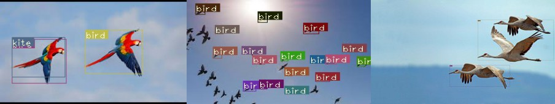
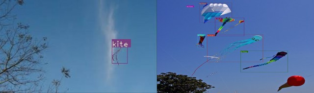
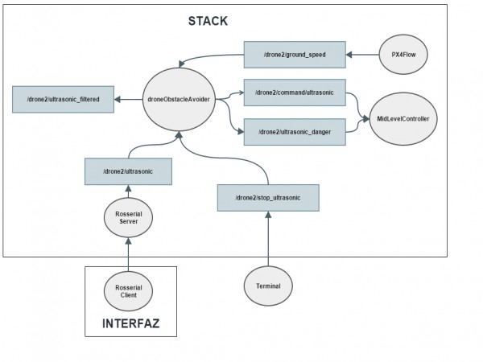

# Obstacle Avoidance for Drone Delivery

This repository implements a simple YOLO algorithm for detection of birds for drones to avoid collision during flight. 

## Results for detection using vision
### Detection of Birds

### Detection of Kites

## System Architecture for Obstacle Detection using Ultrasonic Sensors

# Support
Like my work? Buy me a coffee: https://ko-fi.com/sarthakbhagat
