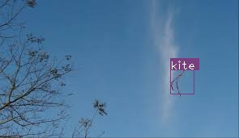

# Obstacle Avoidance for Drone Delivery

This repository implements a simple YOLO algorithm for detection of birds for drones to avoid collision during flight. 

## Results
### Detection of Birds

### Detection of Kites

